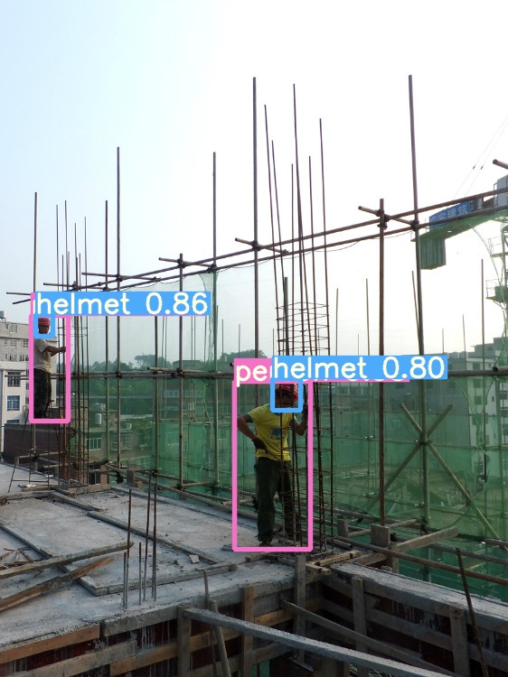
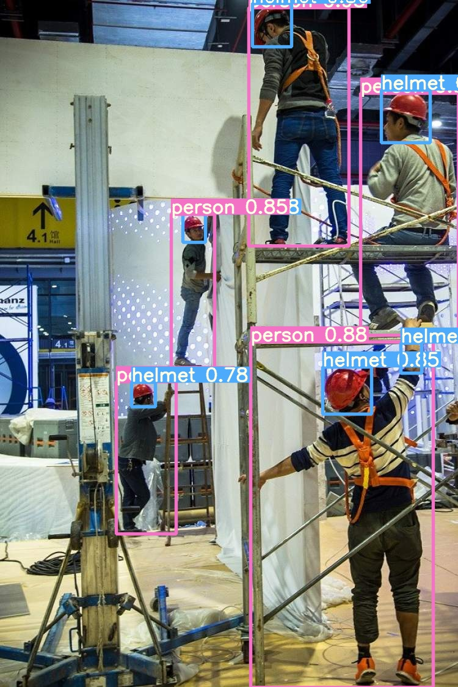
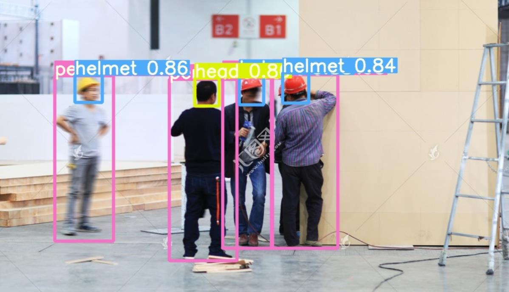
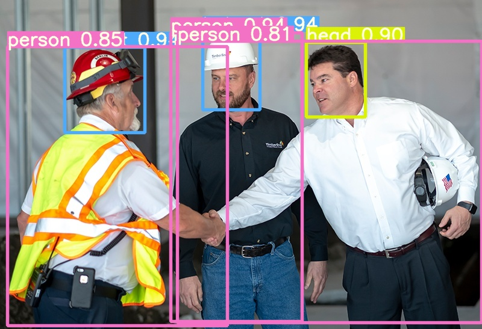
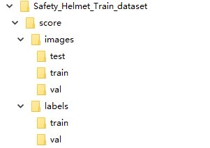

**如果帮到您请给个 star ✨✨✨，您的 star 是我最大的鼓励！**

# Smart_Construction


该项目是使用 `YOLOv5 v2.x` 的程序来训练在智能工地安全领域中头盔目标检测的应用
## 可视化界面演示 ( 2021.3 更新 ) ：
**注意**：如果视频导入之后无法播放，请下载并安装`LAV 解码器`， 下载链接：[LAV 解码器](https://files.1f0.de/lavf/LAVFilters-0.73.1.exe)

GIF。。。


这是使用文档:[如何使用可视化工具](./doc/Visualize_Tool_Tutorial.mds)


## 纯图片再来一波演示！






## 指标
### yolov5s 为基础训练，`epoch = 50`
|分类|P|R|mAP0.5|
|---|---|---|---|
|总体|0.884|0.899|0.888|
|人体|0.846|0.893|0.877|
|头|0.889|0.883|0.871|
|安全帽|0.917|0.921|0.917|

对应的**权重文件**：[百度云](https://pan.baidu.com/s/1ELPhtW-Q4G8UqEr4YrV_5A)，提取码: `b981`

---

### yolov5m 为基础训练，`epoch = 100`
|分类|P|R|mAP0.5|
|---|---|---|---|
|总体|0.886|0.915|0.901|
|人体|0.844|0.906|0.887|
|头|0.9|0.911|0.9|
|安全帽|0.913|0.929|0.916|

对应的**权重文件**：[百度云](https://pan.baidu.com/s/10hlKrgpxVsw4d_vHnPHwEA)，提取码: `psst`

---

### yolov5l 为基础训练，`epoch = 100`
|分类|P|R|mAP0.5|
|---|---|---|---|
|总体|0.892|0.919|0.906|
|人体|0.856|0.914|0.897|
|头|0.893|0.913|0.901|
|安全帽|0.927|0.929|0.919|

对应的**权重文件**：[百度云](https://pan.baidu.com/s/1iMZkRNXY1fowpQCcapFDqw)，提取码: `a66e`

---

# 1.YOLO v5训练自己数据集教程
使用的数据集：[Safety-Helmet-Wearing-Dataset](https://github.com/njvisionpower/Safety-Helmet-Wearing-Dataset) ，感谢这位大神的开源数据集！

> 本文结合 [YOLOv5官方教程](https://github.com/ultralytics/yolov5/wiki/Train-Custom-Data) 来写

## 环境准备
首先确保自己的环境：

```text
    Python >= 3.7
    Pytorch == 1.5.x
    PyQt5
    PyQtChart==5.15.3
    GPUtil
```

## 官方权重
我已上传到一份到百度云：[下载链接](https://pan.baidu.com/s/1mSIjDAzfiJd1fqSxIYzRDA) , 密码: `44qm`

## 训练自己的数据

#### 提示：
**关于增加数据集分类的方法，请看【5. 增加数据集的分类】**

---


### 1.1 创建自己的数据集配置文件

因为我这里只是判断 【人没有带安全帽】、【人有带安全帽】、【人体】 3个类别 ，基于 `data/coco128.yaml` 文件，创建自己的数据集配置文件 `custom_data.yaml`

```yaml

# 训练集和验证集的 labels 和 image 文件的位置
train: ./score/images/train
val: ./score/images/val

# number of classes
nc: 3

# class names
names: ['person', 'head', 'helmet']
```

### 1.2 创建每个图片对应的标签文件

你可以使用 `data/gen_data/gen_head_helmet.py` 来将` VOC` 的数据集转换成 `YOLOv5` 训练需要用到的格式。

使用标注工具类似于 [Labelbox](https://labelbox.com/) 、[CVAT](https://github.com/opencv/cvat) 、[精灵标注助手](http://www.jinglingbiaozhu.com/) 标注之后，需要生成每个图片对应的 `.txt` 文件，其规范如下：
- 每一行都是一个目标
- 类别序号是零索引开始的（从0开始）
- 每一行的坐标 `class x_center y_center width height` 格式
- 框坐标必须采用**归一化的 xywh**格式（从0到1）。如果您的框以像素为单位，则将`x_center`和`width`除以图像宽度，将`y_center`和`height`除以图像高度。代码如下：

```python
import numpy as np
def convert(size, box):
    """
    将标注的 xml 文件生成的【左上角x,左上角y,右下角x，右下角y】标注转换为yolov5训练的坐标
    :param size: 图片的尺寸： [w,h]
    :param box: anchor box 的坐标 [左上角x,左上角y,右下角x,右下角y,]
    :return: 转换后的 [x,y,w,h]
    """

    x1 = int(box[0])
    y1 = int(box[1])
    x2 = int(box[2])
    y2 = int(box[3])

    dw = np.float32(1. / int(size[0]))
    dh = np.float32(1. / int(size[1]))

    w = x2 - x1
    h = y2 - y1
    x = x1 + (w / 2)
    y = y1 + (h / 2)

    x = x * dw
    w = w * dw
    y = y * dh
    h = h * dh
    return [x, y, w, h]
```

生成的 `.txt` 文件放置的名字是图片的名字，放置在 label 文件夹中，例如：
```text
./score/images/train/00001.jpg  # image
./score/labels/train/00001.txt  # label
```

生成的 `.txt` 例子：
```text
1 0.1830000086920336 0.1396396430209279 0.13400000636465847 0.15915916301310062
1 0.5240000248886645 0.29129129834473133 0.0800000037997961 0.16816817224025726
1 0.6060000287834555 0.29579580295830965 0.08400000398978591 0.1771771814674139
1 0.6760000321082771 0.25375375989824533 0.10000000474974513 0.21321321837604046
0 0.39300001866649836 0.2552552614361048 0.17800000845454633 0.2822822891175747
0 0.7200000341981649 0.5570570705458522 0.25200001196935773 0.4294294398277998
0 0.7720000366680324 0.2567567629739642 0.1520000072196126 0.23123123683035374
```

### 1.3 文件放置规范
文件树如下



### 1.4 聚类得出先验框（Yolov5 内部已做适配，可选）
使用代码 `./data/gen_anchors/clauculate_anchors.py` ，修改数据集的路径
```python
FILE_ROOT = r"xxx" # 根路径
ANNOTATION_ROOT = r"xxx"  # 数据集标签文件夹路径
ANNOTATION_PATH = FILE_ROOT + ANNOTATION_ROOT
```
跑完会生成一个文件 `anchors.txt`，里面有得出的建议先验框：
```text
Best Accuracy = 79.72%

Best Anchors = [[14.74, 27.64], [23.48, 46.04], [28.88, 130.0], [39.33, 148.07], [52.62, 186.18], [62.33, 279.11], [85.19, 237.87], [88.0, 360.89], [145.33, 514.67]]
```

### 1.5 选择一个您需要的模型
在文件夹 `./models` 下选择一个你需要的模型然后复制一份出来，将文件开头的 `nc = ` 修改为数据集的分类数，下面是借鉴 `./models/yolov5s.yaml`来修改的

```yaml
# parameters
nc: 3  # number of classes     <============ 修改这里为数据集的分类数
depth_multiple: 0.33  # model depth multiple
width_multiple: 0.50  # layer channel multiple

# anchors
anchors: # <============ 根据 ./data/gen_anchors/anchors.txt 中的 Best Anchors 修改，需要取整（可选）
  - [14,27, 23,46, 28,130] 
  - [39,148, 52,186, 62.,279] 
  - [85,237, 88,360, 145,514]

# YOLOv5 backbone
backbone:
  # [from, number, module, args]
  [[-1, 1, Focus, [64, 3]],  # 0-P1/2
   [-1, 1, Conv, [128, 3, 2]],  # 1-P2/4
   [-1, 3, BottleneckCSP, [128]],
   [-1, 1, Conv, [256, 3, 2]],  # 3-P3/8
   [-1, 9, BottleneckCSP, [256]],
   [-1, 1, Conv, [512, 3, 2]],  # 5-P4/16
   [-1, 9, BottleneckCSP, [512]],
   [-1, 1, Conv, [1024, 3, 2]],  # 7-P5/32
   [-1, 1, SPP, [1024, [5, 9, 13]]],
   [-1, 3, BottleneckCSP, [1024, False]],  # 9
  ]

# YOLOv5 head
head:
  [[-1, 1, Conv, [512, 1, 1]],
   [-1, 1, nn.Upsample, [None, 2, 'nearest']],
   [[-1, 6], 1, Concat, [1]],  # cat backbone P4
   [-1, 3, BottleneckCSP, [512, False]],  # 13

   [-1, 1, Conv, [256, 1, 1]],
   [-1, 1, nn.Upsample, [None, 2, 'nearest']],
   [[-1, 4], 1, Concat, [1]],  # cat backbone P3
   [-1, 3, BottleneckCSP, [256, False]],  # 17

   [-1, 1, Conv, [256, 3, 2]],
   [[-1, 14], 1, Concat, [1]],  # cat head P4
   [-1, 3, BottleneckCSP, [512, False]],  # 20

   [-1, 1, Conv, [512, 3, 2]],
   [[-1, 10], 1, Concat, [1]],  # cat head P5
   [-1, 3, BottleneckCSP, [1024, False]],  # 23

   [[17, 20, 23], 1, Detect, [nc, anchors]],  # Detect(P3, P4, P5)
  ]

```

### 1.6 开始训练
这里选择了 `yolov5s` 模型进行训练，权重也是基于 `yolov5s.pt` 来训练

```shell script
python train.py --img 640 --batch 16 --epochs 10 --data ./data/custom_data.yaml --cfg ./models/custom_yolov5.yaml --weights ./weights/yolov5s.pt
```

其中，`yolov5s.pt` 需要自行下载放在本工程的根目录即可，下载地址 [官方权重](https://drive.google.com/open?id=1Drs_Aiu7xx6S-ix95f9kNsA6ueKRpN2J)

### 1.7 看训练之后的结果
训练之后，权重会保存在 `./runs` 文件夹里面的每个 `exp` 文件里面的 `weights/best.py` ，里面还可以看到训练的效果


# 2. 侦测
侦测图片会保存在 `./inferenct/output/` 文件夹下

运行命令：
```shell script
python detect.py --source   0  # webcam
                            file.jpg  # image 
                            file.mp4  # video
                            path/  # directory
                            path/*.jpg  # glob
                            rtsp://170.93.143.139/rtplive/470011e600ef003a004ee33696235daa  # rtsp stream
                            http://112.50.243.8/PLTV/88888888/224/3221225900/1.m3u8  # http stream
```

例如使用我的 `s` 权重检测图片，可以运行以下命令，侦测图片会保存在 `./inferenct/output/` 文件夹下

```bash
python detect.py --source 图片路径 --weights ./weights/helmet_head_person_s.pt
```

# 3. 检测危险区域内是否有人

## 3.1 危险区域标注方式
我这里使用的是 [精灵标注助手](http://www.jinglingbiaozhu.com/) 标注，生成了对应图片的 json 文件

## 3.2 执行侦测

侦测图片会保存在 `./inferenct/output/` 文件夹下

运行命令：
```shell script
python area_detect.py --source ./area_dangerous --weights ./weights/helmet_head_person_s.pt
```

## 3.3 效果：危险区域会使用 *红色框* 标出来，同时，危险区域里面的人体也会被框出来，危险区域外的人体不会被框选出来


# 4. 生成 ONNX
## 4.1 安装 `onnx` 库

```shell script
pip install onnx
```

## 4.2 执行生成

```shell script
python ./models/export.py --weights ./weights/helmet_head_person_s.pt --img 640 --batch 1
```

`onnx` 和 `torchscript` 文件会生成在 `./weights` 文件夹中

# 5. 增加数据集的分类
关于增加数据集分类的方法：

`SHWD` 数据集里面没有 `person` 的类别，先将现有的自己的数据集执行脚本生成 yolov5 需要的标签文件 `.txt`，之后再用 `yolov5x.pt` 加上 `yolov5x.yaml` ，使用指令检测出人体

```shell script
python detect.py --save-txt --source 自己数据集的文件目录 --weights ./weights/yolov5x.pt
```

`yolov5` 会推理出所有的分类，并在 `inference/output` 中生成对应图片的 `.txt` 标签文件；

修改 `./data/gen_data/merge_data.py` 中的自己数据集标签所在的路径，执行这个python脚本，会进行 `person` 类型的合并 

**如果帮到您请给个 star ✨✨✨，您的 star 是我最大的鼓励！**

**如果能帮到您的项目快速落地，可以 buy me a coffee ☕**


也可以加我的 WeChat 和我一起探讨更多的可能！

